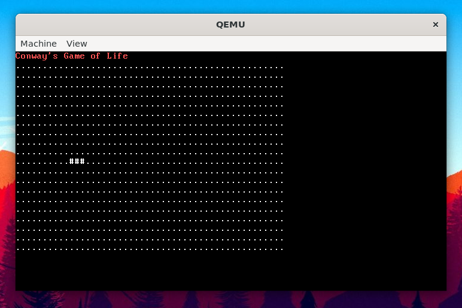

# NOS (Nathan-OS)

Nathan-OS (NOS for short) is a very simple operating system with a bootloader and a kernel. It doesn't do much right now except boot and run a simple Conway's Game of Life simulation, but I'll be working on adding more functionality to it. This project isn't really intended to be turned into a full on operating system, it's more for my own personal learning.

Huge credit goes to this [book](https://www.cs.bham.ac.uk/~exr/lectures/opsys/10_11/lectures/os-dev.pdf), I couldn't have done it without that!

## Running in QEMU (only tested on linux and WSL2)

### Dependencies

    sudo apt install nasm qemu-system-x86_64 build-essential

### Running

    make run

Enjoy! :)

